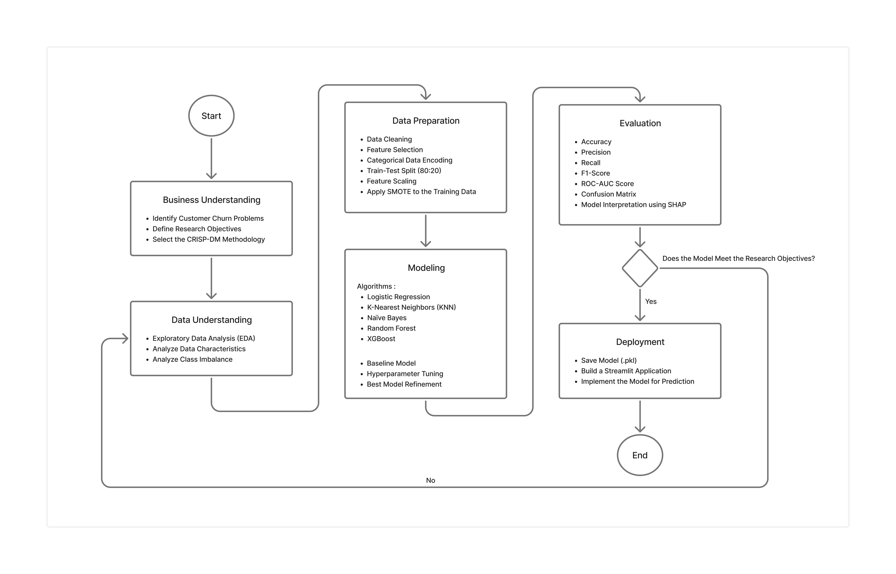
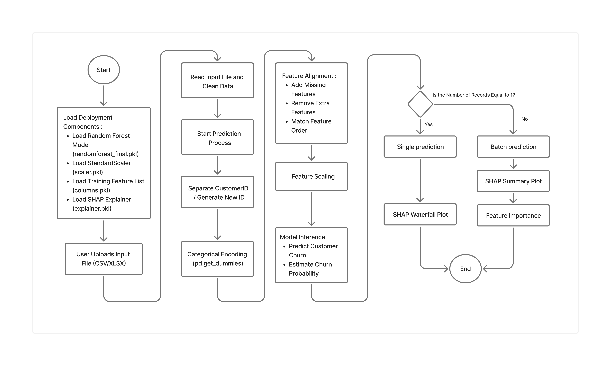

# Telecom Customer Churn Prediction using Machine Learning

📄 **Paper**: Will be added after publication.

---

## 📋 Overview
Customer churn prediction plays an important role in helping telecommunication companies retain customers and reduce customer acquisition costs. This project develops and optimizes machine learning models to predict customer churn using the IBM Telco Customer Churn Dataset within the CRISP-DM framework.

The project compares five supervised learning algorithms—Logistic Regression, K-Nearest Neighbors (KNN), Naïve Bayes, Random Forest, and XGBoost. To improve predictive performance, the workflow incorporates SMOTE for handling class imbalance, GridSearchCV with refinement tuning for hyperparameter optimization, and cross-validation for model evaluation. Model interpretability is enhanced using SHAP (SHapley Additive exPlanations), while the best-performing model is deployed through a Streamlit web application for interactive customer churn prediction.

Experimental results show that Random Forest achieved the best overall performance after optimization, obtaining an Accuracy of 92.76%, Precision of 83.66%, Recall of 90.37%, F1-score of 86.89%, and ROC-AUC of 97.24%. This project demonstrates an end-to-end machine learning workflow that combines predictive performance, model interpretability, and practical deployment to support data-driven customer retention strategies in the telecommunications industry.

### Key Features

- **End-to-End Machine Learning Pipeline**  
  Implements a complete machine learning workflow based on the CRISP-DM methodology, covering data understanding, preprocessing, modeling, evaluation, interpretation, and deployment.

- **Multi-Model Performance Comparison**  
  Evaluates and compares Logistic Regression, K-Nearest Neighbors (KNN), Naïve Bayes, Random Forest, and XGBoost to identify the most effective model for customer churn prediction.

- **Class Imbalance Handling**  
  Applies Synthetic Minority Over-sampling Technique (SMOTE) to improve the model's ability to identify minority-class (churn) customers.

- **Hyperparameter Optimization**  
  Uses GridSearchCV and refinement tuning to optimize model performance and improve generalization.

- **Explainable AI (XAI)**  
  Integrates SHAP (SHapley Additive exPlanations) to explain feature contributions and improve prediction transparency.

- **Interactive Streamlit Application**  
  Provides a user-friendly web interface for predicting customer churn from CSV or Excel files, including both single and batch prediction modes.

- **Prediction Probability & Visualization**  
  Displays churn probability together with SHAP visualizations to help users understand prediction results.

- **High Prediction Performance**  
  The optimized Random Forest model achieved 92.76% Accuracy, 83.66% Precision, 90.37% Recall, 86.89% F1-score, and 97.24% ROC-AUC on the IBM Telco Customer Churn Dataset.

---

## 🎯 Key Contributions

1. **Comprehensive Machine Learning Comparison**  
   Conducted a comparative analysis of five supervised machine learning algorithms—Logistic Regression, K-Nearest Neighbors (KNN), Naïve Bayes, Random Forest, and XGBoost—for customer churn prediction in the telecommunications industry.

2. **Integrated Model Optimization**  
   Improved prediction performance by combining SMOTE for class imbalance handling with GridSearchCV and refinement hyperparameter tuning within a unified CRISP-DM workflow.

3. **Explainable AI Integration**  
   Enhanced model transparency by incorporating SHAP (SHapley Additive exPlanations), enabling interpretation of feature contributions and supporting more explainable decision-making.

4. **Practical Deployment**  
   Developed an interactive Streamlit-based application that allows users to upload customer data, generate churn predictions, view prediction probabilities, and explore SHAP explanations.
   
---

## Project Architecture / Research Workflow

<p align="center">
  
</p>

The research follows the CRISP-DM methodology, consisting of six stages: Business Understanding, Data Understanding, Data Preparation, Modeling, Evaluation, and Deployment. The workflow begins with customer churn data collection from the IBM Telco Customer Churn Dataset, followed by preprocessing, machine learning model development, performance evaluation, SHAP-based model interpretation, and deployment through a Streamlit web application.

### 2. Deployment Workflow

<p align="center">
  
</p>

The deployment workflow illustrates how the trained model is integrated into an interactive Streamlit application. The application first loads the trained Random Forest model together with the preprocessing artifacts, including the StandardScaler, training feature list, and SHAP explainer.

Users can upload customer data in CSV or Excel format. The uploaded data then undergoes preprocessing, including data cleaning, CustomerID handling, categorical encoding, feature alignment with the training dataset, and feature scaling. After preprocessing is completed, the optimized Random Forest model generates customer churn predictions together with the corresponding prediction probabilities.

To improve model interpretability, the application automatically selects the appropriate SHAP visualization based on the number of uploaded records. A **SHAP Waterfall Plot** is generated for single-customer predictions, while a **SHAP Summary Plot** and feature importance visualization are provided for batch predictions. This deployment enables users to obtain accurate, explainable, and interactive customer churn predictions through a web-based interface.

---

## 🌐 Live Demo

The customer churn prediction system has been successfully deployed using Streamlit Community Cloud and can be accessed online at:

**Application:**  
https://telecom-customer-churn-prediction-use-machine-learning.streamlit.app/

---

## 🚀 Installation

### Requirements

- Python 3.10
- pip
- Required Python libraries (see `requirements.txt`):
  - Streamlit
  - Pandas
  - NumPy
  - Matplotlib
  - Scikit-learn
  - Joblib
  - SHAP
  - OpenPyXL
    
### Setup

1. Clone the repository:

```bash
git clone https://github.com/AngelLawrensia/Telecom-Customer-Churn-Prediction.git
cd Telecom-Customer-Churn-Prediction
```

2. Create and activate a Python virtual environment (recommended):

**Windows**
```bash
python -m venv venv
venv\Scripts\activate
```

**macOS / Linux**
```bash
python3 -m venv venv
source venv/bin/activate
```

3. Install the required dependencies:

Run the following command to install all required Python packages listed in `requirements.txt`:

```bash
pip install -r requirements.txt
```

4. Launch the Streamlit application:

```bash
streamlit run app.py
```

5. Open the application in your browser (typically):

```text
http://localhost:8501
```

## 📊 Dataset

This project uses the **IBM Telco Customer Churn Dataset**, a publicly available dataset that contains historical customer information from a telecommunications company. The dataset is widely used for customer churn prediction research and machine learning benchmarking.

| Item | Description |
|------|-------------|
| **Dataset Name** | IBM Telco Customer Churn Dataset |
| **Source** | Kaggle |
| **Dataset Link** | https://www.kaggle.com/datasets/yeanzc/telco-customer-churn-ibm-dataset |
| **Total Records** | 7,043 customers |
| **Total Features** | 33 attributes |
| **Target Variable** | Churn Value |
| **File Format** | CSV |

> **Note:** The dataset is not included in this repository due to licensing considerations. Please download it directly from Kaggle using the link above.

### Dataset Access

The IBM Telco Customer Churn Dataset used in this project can be downloaded from Kaggle:

**Dataset Source:**  
https://www.kaggle.com/datasets/yeanzc/telco-customer-churn-ibm-dataset

Alternatively, the dataset link is also available in:

```
dataset/
└── Link Dataset.txt
```

After downloading, place the dataset in the following directory:

```text
Telecom-Customer-Churn-Prediction/
├── dataset/
│   ├── Telco_customer_churn.xlsx
│   └── Link Dataset.txt
├── models/
├── notebooks/
├── images/
├── app.py
├── requirements.txt
├── runtime.txt
└── README.md

```

---

## 🏋️ Model Training

The machine learning models were developed and evaluated using the Jupyter Notebook provided in the `notebooks/` directory. The training pipeline follows the CRISP-DM methodology and consists of data preprocessing, class imbalance handling, model training, hyperparameter optimization, model evaluation, and model serialization.

### Training Pipeline

1. Load the IBM Telco Customer Churn Dataset.
2. Perform data preprocessing:
   - Data cleaning
   - Feature selection
   - Categorical encoding
   - Train-test split (80:20)
   - Feature scaling
3. Apply SMOTE to balance the training dataset.
4. Train multiple machine learning models:
   - Logistic Regression
   - K-Nearest Neighbors (KNN)
   - Naïve Bayes
   - Random Forest
   - XGBoost
5. Optimize model hyperparameters using GridSearchCV and refinement tuning.
6. Evaluate each model using Accuracy, Precision, Recall, F1-score, ROC-AUC, and Confusion Matrix.
7. Save the best-performing model and preprocessing artifacts for deployment.

### Output Files

After training, the following files are generated:

```text
models/
├── randomforest_final.pkl
├── scaler.pkl
├── columns.pkl
└── explainer.pkl

```

```

### Hardware Requirements

The experiments were conducted on a standard personal computer without GPU acceleration.

Recommended environment:

- Python 3.10
- 8 GB RAM (minimum)
- Windows 10/11 (or equivalent operating system)

```

## 📊 Results

The proposed approach successfully developed an end-to-end customer churn prediction system using the CRISP-DM methodology. After evaluating multiple machine learning algorithms under different experimental settings, the **Random Forest** model with refinement tuning was selected as the final model.

| Model | Accuracy | Precision | Recall | F1-score | ROC-AUC |
|-------|---------:|----------:|--------:|---------:|--------:|
| **Random Forest (Final Model)** | **92.76%** | **83.66%** | **90.37%** | **86.89%** | **97.24%** |

The final model was deployed as an interactive Streamlit application with SHAP-based explainability for both single and batch customer churn prediction.

---

## 🏗️ Project Structure

```text
Telecom-Customer-Churn-Prediction/
│
├── dataset/                       # Dataset reference
│   ├── Link Dataset.txt           # Kaggle dataset link
│
├── images/                        # Figures and documentation assets
│   ├── research_workflow.png
│   ├── deployment_workflow.png
│
├── models/                        # Trained machine learning models
│   ├── randomforest_final.pkl
│   ├── scaler.pkl
│   ├── columns.pkl
│   └── explainer.pkl
│
├── notebooks/                     # Model development and experiments
│   └── Customer_Churn_Model_Training.ipynb
│
├── app.py                         # Streamlit deployment application
├── requirements.txt               # Python dependencies
├── runtime.txt                    # Python Version
├── README.md                      # Project documentation
└── .gitignore                     # Git ignore configuration

```

---

## 📝 Citation

This research has not been formally published yet.

Citation information will be added after publication.

---

## 🙏 Acknowledgments

The author would like to express sincere gratitude to all individuals and organizations that supported the completion of this project.

Special thanks to:

- **Big Data Laboratory**, Information Systems Study Program, Universitas Multimedia Nusantara (UMN), for providing the project template and academic support.
- **Information Systems Study Program**, Universitas Multimedia Nusantara (UMN), for supporting this undergraduate research.
- **IBM** and **Kaggle**, for providing the IBM Telco Customer Churn Dataset used in this research.
- The research supervisor and academic reviewers for their valuable guidance, feedback, and suggestions throughout the research process.

---

## 📧 Contact

For questions or suggestions regarding this project, please open an issue in this repository.

---

## 📜 License

This project is licensed under the MIT License. See the LICENSE file for more details.

---
